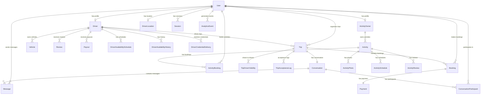
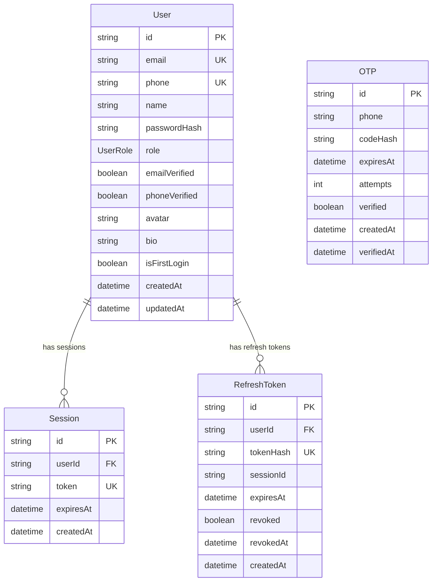
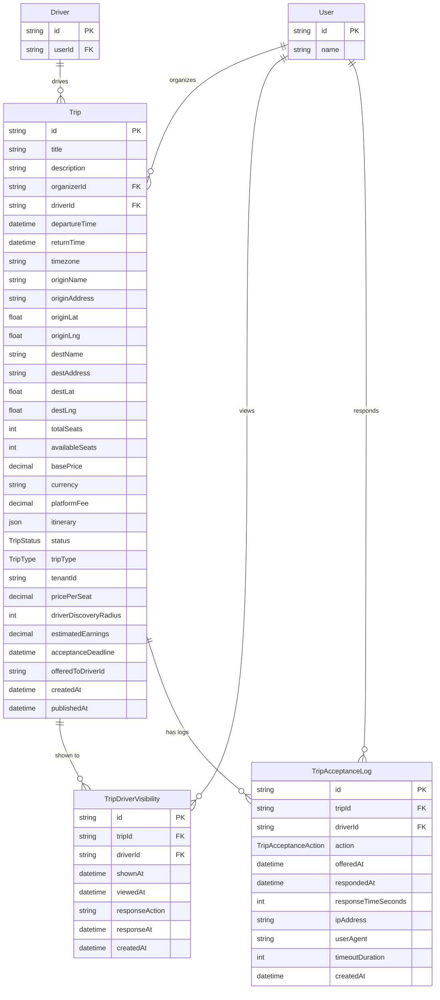
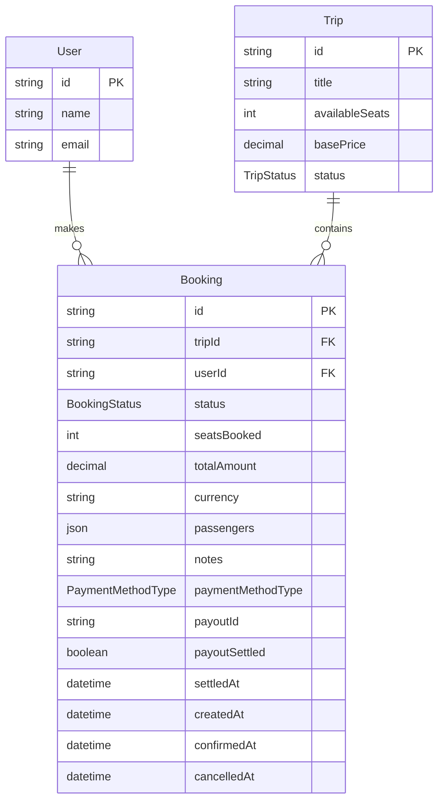
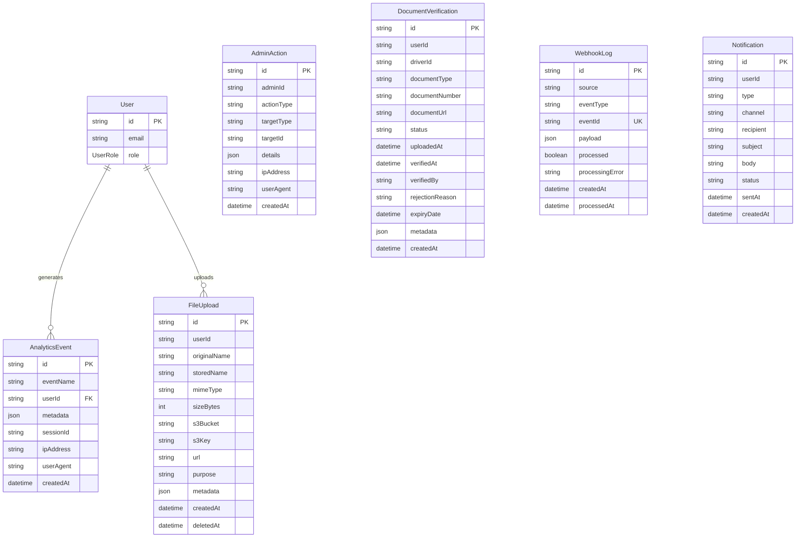

# StepperGO Database Schema - Entity Relationship Diagram

**Version:** 1.0  
**Last Updated:** November 26, 2025  
**Database:** PostgreSQL with Prisma ORM

---

## Table of Contents

1. [Overview](#overview)
2. [Domain Architecture](#domain-architecture)
3. [Complete ER Diagram](#complete-er-diagram)
4. [Domain-Specific Diagrams](#domain-specific-diagrams)
   - [User & Auth Domain](#1-user--auth-domain)
   - [Driver Domain](#2-driver-domain)
   - [Trip Domain](#3-trip-domain)
   - [Passenger & Booking Domain](#4-passenger--booking-domain)
   - [Payment & Payout Domain](#5-payment--payout-domain)
   - [Messaging Domain](#6-messaging-domain)
   - [Activity Owner & Activities Domain](#7-activity-owner--activities-domain)
   - [Admin & Analytics Domain](#8-admin--analytics-domain)
5. [Enumerations](#enumerations)
6. [Key Relationships](#key-relationships)
7. [Data Flow Patterns](#data-flow-patterns)
8. [Index Strategy](#index-strategy)

---

## Overview

The StepperGO platform is built on a sophisticated relational database architecture that supports:

- **Multi-sided marketplace**: Passengers, Drivers, and Activity Owners
- **Dual business models**: Ride-sharing and activity booking
- **Real-time features**: GPS tracking, messaging, driver discovery
- **Financial operations**: Payments, payouts, revenue splitting
- **Comprehensive auditing**: Analytics, admin actions, webhooks

The schema is organized into **8 major domain clusters** with 41 models, supporting both private cab bookings and shared ride-sharing, along with a separate activity booking system.

---

## Domain Architecture

The database architecture organizes models into logical domains:

```
┌─────────────────────────────────────────────────────────────────┐
│                    StepperGO Platform Database                  │
├─────────────────────────────────────────────────────────────────┤
│                                                                 │
│  ┌──────────────────┐      ┌──────────────────┐               │
│  │  User & Auth     │──────│  Driver Domain   │               │
│  │  - User          │      │  - Driver        │               │
│  │  - Session       │      │  - Vehicle       │               │
│  │  - RefreshToken  │      │  - Review        │               │
│  │  - OTP           │      │  - Location      │               │
│  └──────────────────┘      └──────────────────┘               │
│           │                         │                          │
│           │                         │                          │
│  ┌────────┴──────────┐     ┌────────┴──────────┐             │
│  │  Activity Owner   │     │  Trip Domain      │             │
│  │  - ActivityOwner  │     │  - Trip           │             │
│  │  - Activity       │     │  - TripVisibility │             │
│  │  - ActivityPhotos │     │  - AcceptanceLog  │             │
│  └───────────────────┘     └───────────────────┘             │
│           │                         │                          │
│           │                         │                          │
│  ┌────────┴──────────┐     ┌────────┴──────────┐             │
│  │  Activity Booking │     │  Booking Domain   │             │
│  │  - ActivityBooking│─────│  - Booking        │             │
│  │  - ActivityReview │     │  - Payment        │             │
│  └───────────────────┘     └───────────────────┘             │
│                                     │                          │
│                                     │                          │
│  ┌─────────────────────────────────┴────────────┐             │
│  │           Payment & Payout Domain            │             │
│  │           - Payout                           │             │
│  │           - PaymentMethodType                │             │
│  └──────────────────────────────────────────────┘             │
│                                                                 │
│  ┌──────────────────┐      ┌──────────────────┐               │
│  │  Messaging       │      │  Admin & Audit   │               │
│  │  - Conversation  │      │  - AdminAction   │               │
│  │  - Message       │      │  - Analytics     │               │
│  │  - Participant   │      │  - Documents     │               │
│  └──────────────────┘      └──────────────────┘               │
└─────────────────────────────────────────────────────────────────┘
```

---

## Complete ER Diagram

Below is a high-level overview showing all entities and their primary relationships:



---

## Domain-Specific Diagrams

### 1. User & Auth Domain

**Purpose**: Core authentication, user management, and session handling



**Key Features**:
- Email and phone-based authentication
- JWT session management with refresh tokens
- OTP verification for phone numbers
- Support for multiple user roles (PASSENGER, DRIVER, ADMIN, ACTIVITY_OWNER)
- Secure password hashing

---

### 2. Driver Domain

**Purpose**: Driver profiles, vehicles, reviews, availability, and location tracking

```mermaid
erDiagram
    User {
        string id PK
        string email
        string name
        UserRole role
    }
    
    Driver {
        string id PK
        string userId FK_UK
        string driverId UK
        DriverStatus status
        string vehicleType
        string vehicleModel
        string vehicleMake
        int vehicleYear
        string licensePlate
        string licenseNumber
        datetime licenseExpiry
        json documentsUrl
        float rating
        int reviewCount
        int completedTrips
        decimal totalEarnings
        string availability
        boolean acceptsPrivateTrips
        boolean acceptsSharedTrips
        string approvalStatus
        datetime createdAt
        datetime updatedAt
    }
    
    Vehicle {
        string id PK
        string driverId FK
        string make
        string model
        int year
        string color
        string licensePlate
        string type
        int passengerCapacity
        int luggageCapacity
        json amenities
        json photos
        boolean isActive
        datetime createdAt
    }
    
    Review {
        string id PK
        string driverId FK
        string tripId
        int rating
        string comment
        string reviewerId
        string reviewerName
        string response
        datetime respondedAt
        datetime createdAt
    }
    
    DriverLocation {
        string driverId PK_FK
        decimal latitude
        decimal longitude
        decimal heading
        decimal speed
        decimal accuracy
        datetime lastUpdated
        boolean isActive
        datetime createdAt
    }
    
    DriverAvailabilitySchedule {
        string id PK
        string driverId FK
        datetime startTime
        datetime endTime
        string scheduleType
        string reason
        boolean isRecurring
        json recurringPattern
        boolean isActive
        datetime createdAt
    }
    
    DriverAvailabilityHistory {
        string id PK
        string driverId FK
        string previousStatus
        string newStatus
        string changeReason
        string triggeredBy
        datetime changedAt
    }
    
    DriverCredentialDelivery {
        string id PK
        string driverId FK
        DeliveryChannel channel
        DeliveryStatus status
        datetime sentAt
        datetime deliveredAt
        string errorMessage
    }
    
    User ||--|| Driver : "has profile"
    Driver ||--o{ Vehicle : "owns"
    Driver ||--o{ Review : "receives"
    Driver ||--|| DriverLocation : "has location"
    Driver ||--o{ DriverAvailabilitySchedule : "has schedules"
    Driver ||--o{ DriverAvailabilityHistory : "has history"
    Driver ||--o{ DriverCredentialDelivery : "receives"
```

**Key Features**:
- Comprehensive driver verification and approval workflow
- Multi-vehicle support per driver
- Real-time GPS location tracking with heading and speed
- Flexible availability scheduling (breaks, unavailable periods)
- Performance metrics (rating, completed trips, earnings)
- Credential delivery tracking via WhatsApp/SMS/Email

---

### 3. Trip Domain

**Purpose**: Trip creation, driver discovery, assignment, and acceptance workflow



**Key Features**:
- Support for both PRIVATE and SHARED trip types
- Multi-tenant support via tenantId
- Driver discovery system with configurable radius
- Acceptance workflow with timeout tracking
- Comprehensive trip lifecycle (17 status states)
- Estimated earnings calculation
- GPS-based origin and destination tracking

---

### 4. Passenger & Booking Domain

**Purpose**: Booking management, seat allocation, and booking lifecycle



**Key Features**:
- Multi-passenger support (JSON array of passenger details)
- Seat management with availability tracking
- Multiple payment methods (ONLINE, CASH_TO_DRIVER)
- Payout settlement tracking
- Booking lifecycle (PENDING → CONFIRMED → COMPLETED)

---

### 5. Payment & Payout Domain

**Purpose**: Payment processing and driver compensation

```mermaid
erDiagram
    Booking {
        string id PK
        decimal totalAmount
        BookingStatus status
        PaymentMethodType paymentMethodType
    }
    
    Payment {
        string id PK
        string bookingId FK_UK
        string stripeIntentId UK
        string stripeClientSecret
        decimal amount
        string currency
        PaymentStatus status
        string paymentMethod
        string last4
        json metadata
        string errorMessage
        datetime createdAt
        datetime succeededAt
        datetime failedAt
    }
    
    Driver {
        string id PK
        decimal totalEarnings
    }
    
    Payout {
        string id PK
        string driverId FK
        decimal amount
        string currency
        PayoutStatus status
        string payoutMethod
        string payoutProvider
        string stripeTransferId UK
        json providerMetadata
        datetime periodStart
        datetime periodEnd
        int tripsCount
        int bookingsCount
        string tenantId
        json metadata
        datetime createdAt
        datetime processedAt
        datetime failedAt
    }
    
    Booking ||--|| Payment : "has"
    Driver ||--o{ Payout : "receives"
```

**Key Features**:
- Stripe integration for online payments
- Payment intent tracking with client secrets
- 85/15 revenue split (driver/platform)
- Periodic payout aggregation
- Multi-tenant payout support
- Cash-to-driver option (excludes from automated payouts)
- Comprehensive payment and payout status tracking

---

### 6. Messaging Domain

**Purpose**: Trip-based messaging, chat rooms, and real-time communication

```mermaid
erDiagram
    Trip {
        string id PK
        string title
        TripStatus status
    }
    
    User {
        string id PK
        string name
    }
    
    Conversation {
        string id PK
        string tripId FK_UK
        datetime lastMessageAt
        datetime createdAt
        datetime updatedAt
    }
    
    ConversationParticipant {
        string id PK
        string conversationId FK
        string userId FK
        datetime lastReadAt
        int unreadCount
        boolean notificationsEnabled
        datetime joinedAt
        datetime leftAt
    }
    
    Message {
        string id PK
        string conversationId FK
        string senderId FK
        string content
        MessageType type
        json metadata
        MessageStatus status
        boolean isReported
        string reportReason
        boolean isHidden
        datetime sentAt
        datetime deliveredAt
        datetime readAt
        datetime editedAt
    }
    
    Trip ||--|| Conversation : "has"
    Conversation ||--o{ ConversationParticipant : "has"
    Conversation ||--o{ Message : "contains"
    User ||--o{ ConversationParticipant : "participates"
    User ||--o{ Message : "sends"
```

**Key Features**:
- One conversation per trip
- Multi-participant support (organizer, driver, passengers)
- Real-time message delivery status (SENT → DELIVERED → READ)
- Support for multiple message types (TEXT, IMAGE, FILE, LOCATION, SYSTEM)
- Unread count tracking per participant
- Message moderation capabilities
- Notification preferences per participant

---

### 7. Activity Owner & Activities Domain

**Purpose**: Separate business line for tours, excursions, and activity bookings

```mermaid
erDiagram
    User {
        string id PK
        string name
        string email
    }
    
    ActivityOwner {
        string id PK
        string userId FK_UK
        string businessName
        string businessType
        string taxId
        string registrationNumber
        string businessAddress
        string city
        string country
        string phone
        string website
        string verificationStatus
        datetime verifiedAt
        string verifiedBy
        string[] categories
        json documentsUrl
        int totalActivities
        int totalBookings
        decimal totalRevenue
        float averageRating
        datetime createdAt
    }
    
    Activity {
        string id PK
        string ownerId FK
        string title
        string description
        string category
        string status
        string address
        string city
        float latitude
        float longitude
        int pricePerPerson
        string currency
        json groupPricing
        int minParticipants
        int maxParticipants
        int durationMinutes
        string scheduleType
        string[] availableDays
        datetime[] blackoutDates
        int advanceBookingDays
        json cancellationPolicy
        string[] inclusions
        string[] exclusions
        string[] requirements
        int totalBookings
        decimal totalRevenue
        float averageRating
        int reviewCount
        datetime publishedAt
        datetime createdAt
    }
    
    ActivityPhoto {
        string id PK
        string activityId FK
        string url
        string thumbnailUrl
        string cloudinaryId UK
        int width
        int height
        int size
        string format
        string caption
        int order
        boolean isCover
        datetime createdAt
    }
    
    ActivitySchedule {
        string id PK
        string activityId FK
        string dayOfWeek
        string startTime
        string endTime
        boolean isRecurring
        datetime specificDate
    }
    
    ActivityBooking {
        string id PK
        string bookingNumber UK
        string activityId FK
        string passengerId FK
        datetime scheduledDate
        string scheduledTime
        int participants
        json participantDetails
        int pricePerPerson
        int totalAmount
        string currency
        string paymentId
        string paymentStatus
        string status
        datetime cancelledAt
        string cancellationReason
        int refundAmount
        datetime createdAt
    }
    
    ActivityReview {
        string id PK
        string activityId FK
        string bookingId FK_UK
        string passengerId FK
        int rating
        string comment
        string[] photos
        datetime createdAt
    }
    
    User ||--|| ActivityOwner : "has profile"
    ActivityOwner ||--o{ Activity : "owns"
    Activity ||--o{ ActivityPhoto : "has"
    Activity ||--o{ ActivitySchedule : "scheduled"
    Activity ||--o{ ActivityBooking : "booked via"
    Activity ||--o{ ActivityReview : "reviewed via"
    User ||--o{ ActivityBooking : "books"
    User ||--o{ ActivityReview : "writes"
```

**Key Features**:
- Separate business verification for activity owners
- Multi-category support (TOUR, EXCURSION, ATTRACTION, ADVENTURE, etc.)
- Flexible scheduling (FIXED or FLEXIBLE)
- Group pricing tiers
- Photo gallery with cover image
- Activity approval workflow (DRAFT → PENDING_APPROVAL → ACTIVE)
- Blackout dates for unavailable periods
- Comprehensive cancellation policies
- Independent booking system from ride-sharing

---

### 8. Admin & Analytics Domain

**Purpose**: Platform administration, analytics, auditing, and document management



**Key Features**:
- Comprehensive analytics event tracking
- Admin action audit trail for compliance
- Document verification workflow
- File upload management with S3 integration
- Webhook processing logs (Stripe, etc.)
- Multi-channel notifications (email, SMS, push)

---

## Enumerations

### UserRole
```
PASSENGER       - Regular user booking trips
DRIVER          - Verified driver providing rides
ADMIN           - Platform administrator
ACTIVITY_OWNER  - Activity/tour provider
```

### DriverStatus
```
PENDING     - Application submitted, awaiting review
APPROVED    - Approved to drive
REJECTED    - Application rejected
SUSPENDED   - Temporarily suspended
```

### TripType
```
PRIVATE     - Exclusive private cab booking
SHARED      - Shared ride with multiple passengers
```

### TripStatus
```
DRAFT               - Created, not published
PUBLISHED           - Visible to drivers
OFFERED             - Offered to specific driver
FULL                - All seats booked
IN_PROGRESS         - Trip started
DEPARTED            - Left origin
EN_ROUTE            - On the way
DRIVER_ARRIVED      - Driver at pickup location
PASSENGERS_BOARDED  - All passengers in vehicle
IN_TRANSIT          - Traveling to destination
DELAYED             - Running behind schedule
ARRIVED             - Reached destination
COMPLETED           - Trip finished successfully
CANCELLED           - Trip cancelled
```

### TripAcceptanceAction
```
OFFERED   - Trip offered to driver
ACCEPTED  - Driver accepted trip
DECLINED  - Driver declined trip
TIMEOUT   - Acceptance deadline expired
```

### BookingStatus
```
PENDING    - Awaiting confirmation
CONFIRMED  - Booking confirmed
CANCELLED  - Booking cancelled
COMPLETED  - Trip completed
REFUNDED   - Payment refunded
```

### PaymentStatus
```
PENDING     - Payment initiated
PROCESSING  - Payment being processed
SUCCEEDED   - Payment successful
FAILED      - Payment failed
REFUNDED    - Payment refunded
CANCELLED   - Payment cancelled
```

### PayoutStatus
```
PENDING     - Payout scheduled
PROCESSING  - Being processed
PAID        - Successfully paid
FAILED      - Payout failed
CANCELLED   - Payout cancelled
```

### PaymentMethodType
```
ONLINE          - Online payment via Stripe
CASH_TO_DRIVER  - Cash payment directly to driver
```

### MessageType
```
TEXT     - Text message
IMAGE    - Image attachment
FILE     - File attachment
LOCATION - GPS location share
SYSTEM   - System-generated message
```

### MessageStatus
```
SENT      - Message sent
DELIVERED - Message delivered
READ      - Message read
FAILED    - Message delivery failed
```

### DeliveryChannel
```
WHATSAPP  - WhatsApp message
SMS       - SMS text message
EMAIL     - Email message
```

### DeliveryStatus
```
SENT      - Message sent
DELIVERED - Confirmed delivery
FAILED    - Delivery failed
READ      - Message read (if supported)
```

---

## Key Relationships

### One-to-One Relationships
- `User ↔ Driver`: Each user can be a driver
- `User ↔ ActivityOwner`: Each user can be an activity owner
- `User ↔ DriverLocation`: Real-time location per driver
- `Trip ↔ Conversation`: Each trip has one chat room
- `Booking ↔ Payment`: Each booking has one payment record
- `ActivityBooking ↔ ActivityReview`: Each booking can have one review

### One-to-Many Relationships
- `User → Bookings`: Users make multiple bookings
- `User → Trips`: Users organize multiple trips
- `Driver → Vehicles`: Drivers can have multiple vehicles
- `Driver → Payouts`: Drivers receive periodic payouts
- `Trip → Bookings`: Trips contain multiple bookings
- `Activity → ActivitySchedules`: Activities have multiple time slots
- `ActivityOwner → Activities`: Activity owners list multiple activities

### Many-to-Many Relationships (via Join Tables)
- `Trip ↔ Driver`: Via `TripDriverVisibility` (driver discovery)
- `Conversation ↔ User`: Via `ConversationParticipant` (chat members)

---

## Data Flow Patterns

### 1. User Registration Flow
```
User Registration
    ↓
User Created (role: PASSENGER)
    ↓
[Optional] Driver Profile Creation
    ↓
Driver Verification & Approval
    ↓
Driver Approved → Can Accept Trips
```

### 2. Trip Booking Flow (Passenger)
```
Passenger Creates Trip
    ↓
Trip Published (status: PUBLISHED)
    ↓
Driver Discovery (TripDriverVisibility)
    ↓
Driver Accepts Trip
    ↓
Passenger Creates Booking
    ↓
Payment Processing (Payment)
    ↓
Booking Confirmed
    ↓
Trip Starts (Real-time Tracking)
    ↓
Trip Completed
    ↓
Payout Settlement (Payout)
```

### 3. Messaging Flow
```
Trip Created
    ↓
Conversation Auto-Created
    ↓
Participants Added (Organizer, Driver, Passengers)
    ↓
Messages Exchanged
    ↓
Delivery & Read Status Tracked
```

### 4. Activity Booking Flow
```
ActivityOwner Lists Activity
    ↓
Activity Verified & Published
    ↓
Passenger Browses & Books
    ↓
ActivityBooking Created
    ↓
Payment Processed
    ↓
Activity Completed
    ↓
Passenger Writes ActivityReview
```

### 5. Payout Flow
```
Booking Completed (paymentMethodType: ONLINE)
    ↓
Marked for Payout Settlement
    ↓
Periodic Payout Aggregation
    ↓
Payout Created (85% to driver, 15% platform fee)
    ↓
Payout Processed via Provider
    ↓
Driver Receives Payment
```

---

## Index Strategy

### Critical Indexes for Performance

**User Domain**
- `User.email` - Login lookups
- `User.phone` - Phone authentication
- `Session.token` - Session validation

**Driver Domain**
- `Driver.status` - Filter by verification status
- `Driver.availability` - Find available drivers
- `DriverLocation(latitude, longitude)` - Geospatial queries
- `Driver.lastActivityAt` - Auto-offline detection

**Trip Domain**
- `Trip(status, driverDiscoveryRadius)` - Driver discovery
- `Trip(originLat, originLng)` - Geospatial search
- `Trip.departureTime` - Upcoming trips
- `Trip.acceptanceDeadline` - Timeout processing

**Booking Domain**
- `Booking(tripId, userId)` - User bookings
- `Booking(payoutSettled)` - Payout processing
- `Booking(paymentMethodType)` - Payment filtering

**Messaging Domain**
- `Message(conversationId, sentAt)` - Message history
- `ConversationParticipant(userId, conversationId)` - User conversations

**Activity Domain**
- `Activity(status, publishedAt)` - Published activities
- `Activity(city, category)` - Search filters
- `ActivityBooking(scheduledDate)` - Date-based queries

---

## Multi-Tenant Support

The schema supports multi-tenancy via:
- `Trip.tenantId` - Organization-level trip isolation
- `Payout.tenantId` - Tenant-specific payout processing

This enables:
- Multiple organizations on the same platform
- Separate financial reporting per tenant
- Tenant-specific business rules

---

## Security & Privacy Considerations

1. **Password Security**: Passwords stored as bcrypt hashes (`User.passwordHash`)
2. **Token Security**: Refresh tokens stored as hashes (`RefreshToken.tokenHash`)
3. **OTP Security**: OTP codes stored as hashes (`OTP.codeHash`)
4. **Payment Security**: Only last 4 digits stored (`Payment.last4`)
5. **Soft Deletes**: `FileUpload.deletedAt` for data retention
6. **Audit Trail**: `AdminAction` logs all administrative actions
7. **IP Tracking**: Critical actions log IP addresses

---

## JSON Field Structures

### Trip.itinerary
```json
{
  "stops": [
    {
      "order": 1,
      "name": "Pickup Point",
      "address": "...",
      "lat": 43.238293,
      "lng": 76.889710,
      "arrivalTime": "2025-01-15T08:00:00Z"
    }
  ]
}
```

### Booking.passengers
```json
[
  {
    "name": "John Doe",
    "phone": "+77001234567",
    "age": 30,
    "isChild": false
  }
]
```

### Activity.groupPricing
```json
[
  {
    "minParticipants": 5,
    "maxParticipants": 10,
    "pricePerPerson": 15000
  }
]
```

### Driver.documentsUrl
```json
{
  "license": "https://...",
  "insurance": "https://...",
  "registration": "https://..."
}
```

---

## Database Statistics

- **Total Models**: 41
- **Total Enums**: 10
- **Primary Relationships**: 60+
- **Indexes**: 100+
- **Supported Languages**: Multiple (via Driver.languages JSON)
- **Currency Support**: Multi-currency (default: KZT)
- **Timezone Support**: Per-trip timezone tracking

---

## Conclusion

This database schema supports a sophisticated multi-sided marketplace platform with:

✅ **Scalability**: Indexed for high-performance queries  
✅ **Flexibility**: JSON fields for extensibility  
✅ **Security**: Comprehensive audit trails and data protection  
✅ **Real-time**: GPS tracking, messaging, live updates  
✅ **Multi-tenant**: Organization-level data isolation  
✅ **Financial**: Complete payment and payout lifecycle  
✅ **Compliance**: Document verification and admin oversight  

The architecture is production-ready and follows best practices for relational database design with PostgreSQL and Prisma ORM.

---

**For Questions or Updates**: Contact the development team or refer to the [Prisma schema file](../prisma/schema.prisma)
