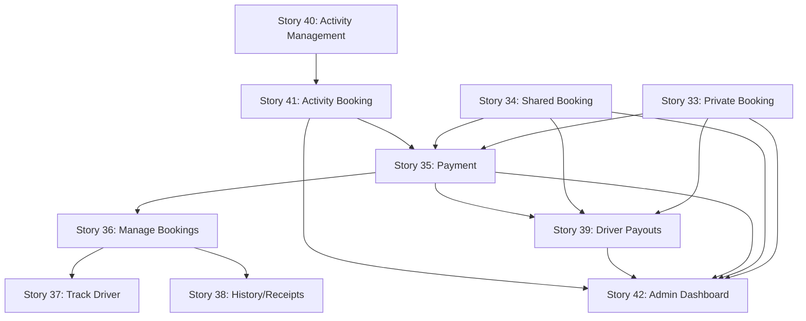

# User Stories 33-42: Passenger Booking & Platform Features

## Overview
This document provides an index of user stories 33-42, which cover the complete passenger booking experience, driver payouts, activity management, and admin monitoring capabilities for the StepperGO platform.

---

## 📋 Story Index

### Passenger Booking & Experience (Stories 33-38)

#### Story 33: Passenger Book Private Trip
**File:** `33-passenger-book-private-trip.md`  
**Focus:** Private cab booking with date/time selection, fare calculation, and booking confirmation  
**Key Features:**
- Landing page search widget integration
- Location autocomplete for origin/destination
- Real-time fare and time estimation
- Pending payment state management

---

#### Story 34: Passenger Book Shared Ride Seat
**File:** `34-passenger-book-shared-ride-seat.md`  
**Focus:** Shared ride booking with per-seat pricing and availability management  
**Key Features:**
- Seat availability display
- Multi-seat booking capability
- Optimistic locking for concurrent bookings
- Per-seat fare calculation

---

#### Story 35: Passenger Pay for Booking Online
**File:** `35-passenger-pay-for-booking-online.md`  
**Focus:** Secure online payment processing with Stripe integration  
**Key Features:**
- Payment intent creation
- Webhook signature verification
- Payment status tracking (paid/failed/cancelled)
- Booking status transitions
- Confirmation notifications

---

#### Story 36: Passenger Manage Upcoming Bookings
**File:** `36-passenger-manage-upcoming-bookings.md`  
**Focus:** Trip management dashboard with cancellation and refund capabilities  
**Key Features:**
- Upcoming trips listing
- Detailed booking information
- Cancellation workflow with policy display
- Refund processing trigger
- Seat availability restoration

---

#### Story 37: Passenger Track Driver in Real Time
**File:** `37-passenger-track-driver-in-real-time.md`  
**Focus:** Live driver location tracking with map visualization and ETA  
**Key Features:**
- Real-time location updates (5-10 second intervals)
- WebSocket/SSE integration
- "Driver is nearby" notifications
- Offline/fallback state handling
- Access control for location data

---

#### Story 38: Passenger View Trip History and Receipts
**File:** `38-passenger-view-trip-history-and-receipts.md`  
**Focus:** Trip history and receipt generation for record-keeping  
**Key Features:**
- Paginated trip history
- Detailed itinerary viewing
- PDF/HTML receipt download
- Email receipt re-sending
- Payment data security (masked card numbers)

---

### Driver Features (Story 39)

#### Story 39: Driver Receive Automatic Payouts
**File:** `39-driver-receive-automatic-payouts.md`  
**Focus:** Automated driver earnings distribution via Stripe Connect  
**Key Features:**
- Payout account configuration
- Periodic earnings calculation (weekly/monthly)
- Platform commission deduction
- Payout status tracking (pending/processing/paid/failed)
- Historical payout records
- Trip completion and refund reconciliation

---

### Activity Management (Stories 40-41)

#### Story 40: Activity Owner Manage Activities
**File:** `40-activity-owner-manage-activities.md`  
**Focus:** Activity creation and management dashboard for tour/event operators  
**Key Features:**
- Activity owner dashboard
- Activity creation (title, description, location, pricing)
- Photo upload with validation
- Schedule pattern configuration
- Capacity management
- Booking statistics visibility
- Approval/verification workflow

---

#### Story 41: Passenger Browse and Book Activities
**File:** `41-passenger-browse-and-book-activities.md`  
**Focus:** Activity discovery, browsing, and booking for passengers  
**Key Features:**
- Activities section navigation
- Filtering (location, date, category, price)
- Sorting (popularity, rating, price)
- Detailed activity pages with photo gallery
- Date/time slot selection
- Participant count specification
- Standard payment flow integration
- Availability updates to prevent overbooking

---

### Admin Operations (Story 42)

#### Story 42: Admin Monitor Bookings and Revenue
**File:** `42-admin-monitor-bookings-and-revenue.md`  
**Focus:** Comprehensive admin dashboard for operational monitoring  
**Key Features:**
- Real-time metrics dashboard
  - Active trips count
  - Upcoming trips for the day
  - Daily/weekly booking totals
  - Gross bookings and net revenue
- Active trips table (ID, route, driver, status)
- Recent bookings table (ID, user, type, payment status)
- Advanced filtering (status, date range, trip type)
- Drill-down to detailed booking/trip information
- Periodic/on-demand refresh

---

## 🎯 Implementation Phases

### Phase 1: Core Booking Flow (Stories 33-35)
**Priority:** HIGH  
**Dependencies:** Existing trip models, payment provider integration  
**Estimated Timeline:** 3-4 weeks

1. Story 33: Private trip booking foundation
2. Story 34: Shared ride seat booking
3. Story 35: Payment processing integration

**Deliverables:**
- Working booking widget on landing page
- Complete payment flow with Stripe
- Booking confirmation and notifications

---

### Phase 2: Booking Management (Stories 36-38)
**Priority:** MEDIUM-HIGH  
**Dependencies:** Phase 1 completion, messaging system  
**Estimated Timeline:** 2-3 weeks

1. Story 36: Trip management dashboard
2. Story 37: Real-time tracking (WebSocket integration)
3. Story 38: History and receipt generation

**Deliverables:**
- "My Trips" dashboard
- Live driver tracking interface
- PDF receipt generation system

---

### Phase 3: Marketplace Expansion (Stories 39-41)
**Priority:** MEDIUM  
**Dependencies:** Phase 1-2 completion, activity models  
**Estimated Timeline:** 3-4 weeks

1. Story 39: Driver payout automation
2. Story 40: Activity owner portal
3. Story 41: Activity booking for passengers

**Deliverables:**
- Automated payout system with Stripe Connect
- Activity owner dashboard
- Activity browsing and booking flow

---

### Phase 4: Platform Operations (Story 42)
**Priority:** MEDIUM  
**Dependencies:** All previous phases  
**Estimated Timeline:** 1-2 weeks

1. Story 42: Admin monitoring dashboard

**Deliverables:**
- Comprehensive admin dashboard
- Real-time operational metrics
- Booking and revenue analytics

---

## 🔗 Story Dependencies

---

## 📊 Success Metrics

### Passenger Booking Metrics
- **Booking Completion Rate:** Target 80%+ (Story 33-34)
- **Payment Success Rate:** Target 95%+ (Story 35)
- **Cancellation Rate:** Monitor <15% (Story 36)
- **Real-time Tracking Usage:** Target 70%+ of active trips (Story 37)

### Driver & Activity Metrics
- **Payout Success Rate:** Target 99%+ (Story 39)
- **Activity Booking Conversion:** Target 20%+ (Story 41)
- **Activity Owner Satisfaction:** Target 4.5/5 stars (Story 40)

### Platform Operations
- **Admin Dashboard Usage:** Daily active use by operations team (Story 42)
- **Issue Response Time:** <5 minutes for critical issues
- **Revenue Tracking Accuracy:** 100% reconciliation

---

## 🛠️ Technical Considerations

### Database Schema Updates Required
- **Bookings Table:** Add `seatsBooked`, `totalAmount`, `paymentStatus`, `bookingStatus`
- **Payments Table:** Add `paymentIntentId`, `provider`, `webhookSignature`
- **Payouts Table:** New table for driver earnings distribution
- **Activities Table:** New table for tour/event management
- **ActivityBookings Table:** New table linking passengers to activities

### API Endpoints to Implement
- `POST /api/bookings/create` - Create booking (Stories 33-34)
- `POST /api/payments/initiate` - Start payment flow (Story 35)
- `POST /api/payments/webhook` - Payment provider webhooks (Story 35)
- `GET /api/bookings/upcoming` - Fetch user's upcoming trips (Story 36)
- `POST /api/bookings/:id/cancel` - Cancel booking (Story 36)
- `GET /api/tracking/driver/:driverId/live` - Live driver location (Story 37)
- `GET /api/bookings/history` - Trip history (Story 38)
- `GET /api/receipts/:bookingId/download` - Generate receipt (Story 38)
- `POST /api/payouts/process` - Trigger driver payouts (Story 39)
- `POST /api/activities/create` - Create activity (Story 40)
- `GET /api/activities/search` - Browse activities (Story 41)
- `GET /api/admin/dashboard/metrics` - Dashboard data (Story 42)

### Third-Party Integrations
- **Stripe:** Payment processing, Connect for driver payouts
- **WebSocket/SSE:** Real-time driver tracking
- **PDF Library:** Receipt generation (e.g., react-pdf, pdfkit)
- **Email Service:** Receipt delivery (e.g., SendGrid, AWS SES)
- **SMS/WhatsApp:** Booking confirmations (optional)

---

## 📚 Related Documentation

- **Technical Specifications:** See `docs/technical-description/`
- **Implementation Plans:** See `docs/implementation-plans/`
- **Database Schema:** See `prisma/schema.prisma`
- **API Documentation:** See `docs/api/` (to be created)

---

## ✅ Story Completion Checklist

For each story, ensure the following before marking as complete:

- [ ] All acceptance criteria met
- [ ] Unit tests written and passing
- [ ] Integration tests for API endpoints
- [ ] UI components responsive and accessible
- [ ] Error handling comprehensive
- [ ] Security review completed
- [ ] Documentation updated
- [ ] Code review approved
- [ ] Deployed to staging environment
- [ ] User acceptance testing passed
- [ ] Production deployment completed

---

**Document Version:** 1.0  
**Last Updated:** November 24, 2025  
**Author:** StepperGO Development Team  
**Status:** Ready for Implementation
